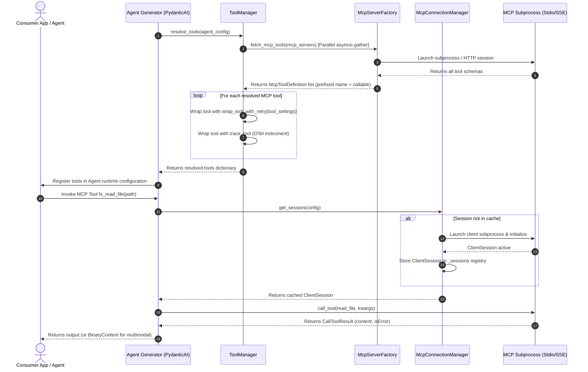

# Model Context Protocol (MCP) Integration Guide

This guide describes how the Model Context Protocol (MCP) is integrated into standard agents within the repository.

---

## 1. Overview & Setup

The Model Context Protocol (MCP) allows agents to connect to external servers (either over local standard input/output subprocesses or remote HTTP SSE connections) to fetch dynamic tool schemas and execute them.

```yaml
agent:
  name: "mcp_enabled_agent"
  mcp_servers:
    filesystem:
      type: "stdio"
      command: "npx"
      args: ["-y", "@modelcontextprotocol/server-filesystem", "/path/to/workspace"]
      tool_prefix: "fs"
      enabled_tools:
        - "read_file"
      disabled_tools:
        - "write_file"
      native_pydantic_toolset: false
  tool_settings:
    fs_read_file:
      raise_on_error: false
      retry:
        attempts: 3
        delay: 2.0
```

### Whitelisting & Filtering Rules
* **`enabled_tools`**: If specified, only tool names matching this list are exposed to the agent.
* **`disabled_tools`**: If specified, tool names matching this list are filtered out and hidden from the agent.

### Advanced Configuration Options
* **`tool_prefix`**: Optional namespace prefix (e.g. `tool_prefix: "fs"` creates `fs_read_file`). This prevents name collisions when integrating multiple MCP servers exposing identical tool names (e.g., `github_search` vs. `jira_search`). The original remote name is preserved in `McpToolDefinition.original_name` for RPC execution.
* **`native_pydantic_toolset`**: Boolean flag (default `false`). When `true`, Pydantic AI mounts native `pydantic_ai.mcp.MCPToolset` instances directly into the agent rather than resolving via `ToolManager`, enabling advanced features like LLM sampling and deferred tool loading.
* **`raise_on_error`**: Configured under `tool_settings` for target tools. When `true`, remote server error flags (`CallToolResult.isError`) raise a `RuntimeError` immediately instead of returning self-correcting diagnostic text to the model.

### Subsystem Structure (`src/tools/mcp/` & `src/tools/contracts/`)
The MCP integration is consolidated under the unified tools package:
* **`src/tools/manager.py`**: Central `ToolManager` facade coordinating parallel async MCP discovery, caching, and retry/tracing wrappers.
* **`src/tools/contracts/mcp.py`**: Framework-neutral `McpToolDefinition` dataclass storing callable, schema, and original name.
* **`src/tools/mcp/client.py`**: Client sessions, `McpServerFactory` parallel tool fetcher, and async tool call wrappers.
* **`src/tools/mcp/manager.py`**: `McpConnectionManager` for connection caching and thread-safe session reuse.
* **`src/tools/mcp/server.py`**: `McpServerConfigSchema` server configurations and parameter parsers.

---

## 2. Persistent Connection Caching

To prevent spawning expensive subprocesses on every tool call, we manage connection sessions via `McpConnectionManager`.
* **Caching**: Sessions (`ClientSession`) are cached by a unique configuration key.
* **Concurrency**: Connection creation is synchronized via `asyncio.Lock`.
* **Lifespan Clean-up**: All active sessions are terminated on application shutdown by calling `ToolManager.close_all()` (or `McpConnectionManager.close_all()`) in the FastAPI lifespan.

---

## 3. Resilience & Multimodal Features

### 3.1 Resilient Error Handling (`isError`)
`make_mcp_tool_callable` inspects `CallToolResult.isError` returned by MCP servers:
* Annotates active OpenTelemetry spans with `StatusCode.ERROR` and records `tool.is_error = True`.
* If `raise_on_error: false` (default), returns a structured error string (`MCP Tool Error: ...`) back to the model for self-healing prompt recovery.
* If `raise_on_error: true`, raises a `RuntimeError` to halt or trigger outer retry loops.

### 3.2 Multimodal Content Extraction
When an MCP tool returns image blocks (`ImageContent`), the client extracts raw base64 data and MIME types into structured payloads. `PydanticAIAgentGenerator` automatically adapts these payloads into native Pydantic AI `BinaryContent` parts for vision models.

---

## 4. Tool Resolution Sequence Flow

The sequence diagram below details how MCP servers are resolved, wrapped, and executed with namespacing and granular retry policies:


