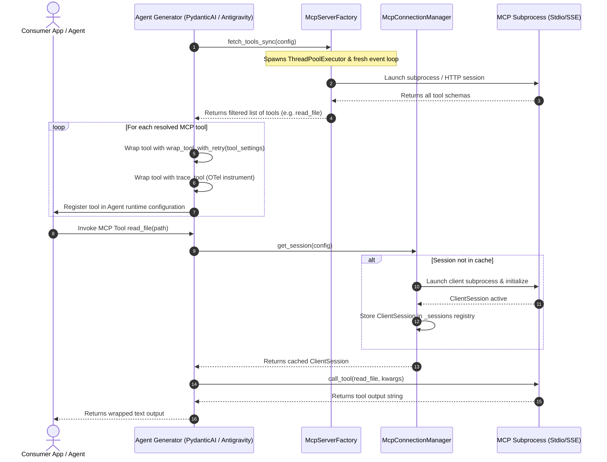

# Model Context Protocol (MCP) Integration Guide

This guide describes how the Model Context Protocol (MCP) is integrated into standard agents within the repository.

---

## 1. Overview & Setup

The Model Context Protocol (MCP) allows agents to connect to external servers (either over local standard input/output subprocesses or remote HTTP SSE connections) to fetch dynamic tool schemas and execute them.

```yaml
agent:
  name: "mcp_enabled_agent"
  mcp_servers:
    filesystem:
      type: "stdio"
      command: "npx"
      args: ["-y", "@modelcontextprotocol/server-filesystem", "/path/to/workspace"]
      enabled_tools:
        - "read_file"
      disabled_tools:
        - "write_file"
```

### Whitelisting & Filtering Rules
* **`enabled_tools`**: If specified, only tool names matching this list are exposed to the agent.
* **`disabled_tools`**: If specified, tool names matching this list are filtered out and hidden from the agent.

---

## 2. Persistent Connection Caching

To prevent spawning expensive subprocesses on every tool call, we manage connection sessions via `McpConnectionManager`.
* **Caching**: Sessions (`ClientSession`) are cached by a unique configuration key.
* **Concurrency**: Connection creation is synchronized via `asyncio.Lock`.
* **Lifespan Clean-up**: All active sessions are terminated on application shutdown by calling `McpConnectionManager.close_all()` in the FastAPI lifespan.

---

## 3. Tool Resolution Sequence Flow

The sequence diagram below details how MCP servers are resolved, wrapped, and executed with granular retry policies:


