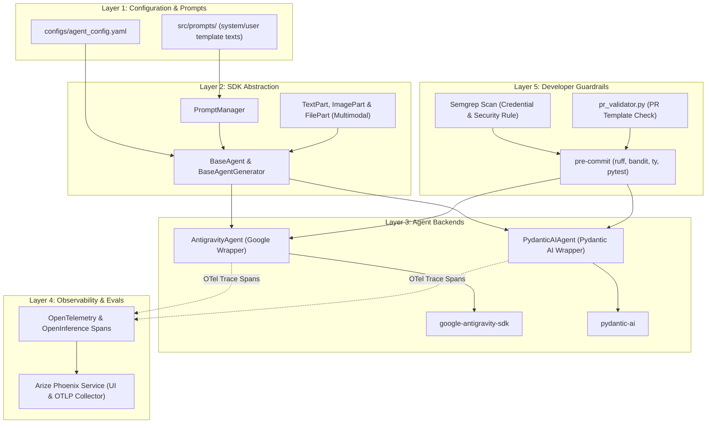
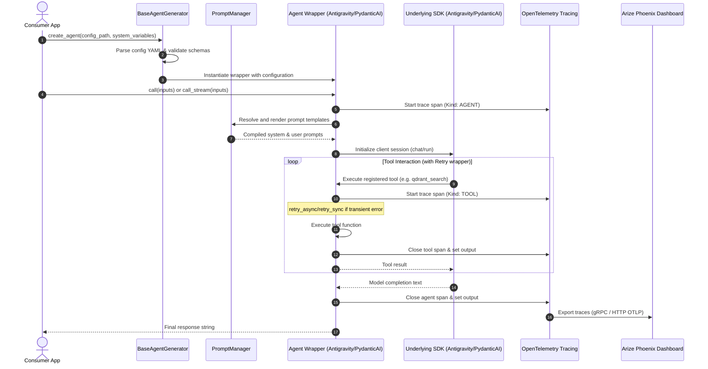
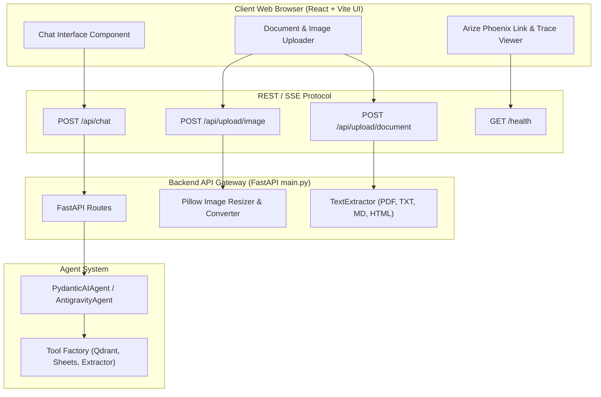
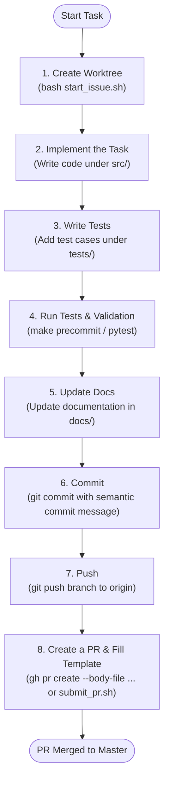

# Architecture & Flow Diagrams

This document contains Mermaid diagrams illustrating the repository architecture, runtime execution, API + Frontend interactions, and observability telemetry flows.

---

## 1. High-Level System Architecture

---

## 2. Runtime Execution Flow

---

## 3. Frontend & FastAPI Service Communication

---

## 4. Developer Contribution Flow

