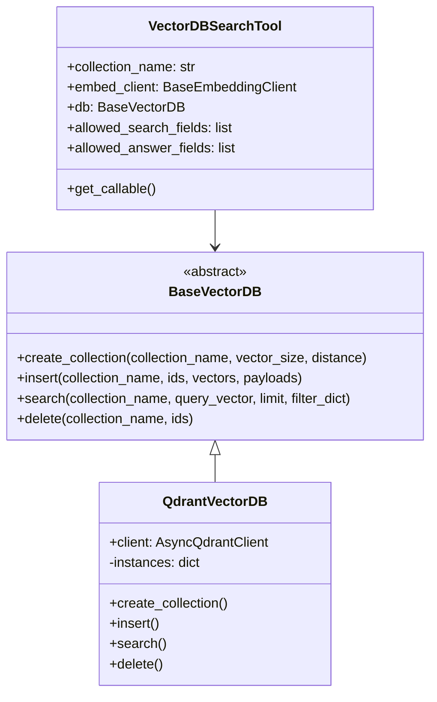

# Codebase Components & Architecture

This document provides a technical walkthrough of the core components in the Standardized Agentic Project Template.

---

## 1. Configuration & Prompts

### Agent Configuration (`configs/agent_config.yaml`)

- **Purpose**: Defines an agent's structural configuration declaratively, separating behavior from core application code.
- **Attributes**:
  - `provider`: Target LLM provider (e.g., `google`, `pydantic-ai`, `openai`).
  - `model`: The model identifier (e.g., `gemini-2.5-flash`).
  - `system_prompt_source`: Path to the system prompt template (relative or absolute).
  - `user_prompt_source`: Path to the default user prompt template.
  - `user_prompt_format`: Template format, supporting formats like `f-string`.
  - `tools`: A list of registered tool names that the agent can execute.
  - `retry`: Configuration parameters for retrying transient failures.
    - `attempts`: Maximum number of attempts (default: 3, minimum: 1).
    - `delay`: Wait time in seconds between retries (default: 5.0, minimum: 0.0).

### Prompt Templates (`src/prompts/`)

- **`system_prompt.txt`**: System prompt base template. Supports dynamic formatting (e.g., embedding roles, rules, or instructions at runtime).
- **`user_prompt.txt`**: User input formatting template. Restructures incoming user queries consistently.

---

## 2. SDK Abstractions

### Core Abstractions (`src/agents/base.py`)

- **`BaseAgent`**: Abstract interface enforcing asynchronous call conventions (`call`, `call_stream`, and synchronous wrapper `call_sync`) for all agent implementations.
- **`BaseAgentGenerator`**: Abstract factory interface for parsing configurations and spawning appropriate `BaseAgent` instances.
- **`AgentInputPart`**: Support for multimodal payloads, supporting `TextPart` (text prompt wrappers), `ImagePart` (raw bytes or absolute path references with mime-types), and `FilePart` (text file references with extracted content support).
- **`ToolConfig` & `McpServerConfig`**: Interfaces for registering local tool functions or Model Context Protocol (MCP) server endpoints.

### Configuration Parsing (`src/agents/config.py`)

- **`AgentConfigSchema`**: Pydantic schema representing raw YAML keys for strict parsing and input validation.
- **`AgentYamlConfig`**: Holds validated and fully resolved agent attributes used by concrete generators.
- **`ImageConstraints`**: Pydantic model defining image upload limits (acceptable types, dimensions).
- **`FileConstraints`**: Pydantic model defining text file upload limits (acceptable MIME types, max size, max files per message).

### Prompt Resolution (`src/agents/prompt_manager.py`)

- **`PromptManager`**: Locates, caches, and compiles raw text templates into active prompts. Implements f-string replacements to merge system variables or session constraints dynamically before calling the model.

### Text Extraction (`src/tools/text_extractor.py`)

- **`extract_text(data, mime_type)`**: Dispatches bytes to the appropriate extractor based on MIME type.
  - **PDF** → Page-by-page extraction via PyMuPDF (AGPL-3.0 licensed).
  - **TXT** → UTF-8 decode with Latin-1 fallback.
  - **Markdown** → Raw passthrough (the LLM understands Markdown natively).
  - **HTML** → Multi-step pipeline: strips `<script>` and `<style>` blocks, replaces `` tags with `[Image: <alt>]` placeholders, strips remaining HTML tags, collapses whitespace.

---

## 3. Implementation Backends

### Google Antigravity Wrapper (`src/agents/google_antigravity.py`)

- **`AntigravityAgent`**: Envelops the `google-antigravity-sdk`. Spawns a `G_Agent` instance, converts generic inputs to Antigravity's payload types, and executes calls via the SDK's context manager chat interface.
- **`AntigravityAgentGenerator`**: Leverages YAML configuration and registered tools to build a `LocalAgentConfig` and yield a running agent.
- **`trace_tool`**: A custom python decorator wrapping agent tools with OpenTelemetry span properties adhering to the OpenInference semantic convention.

### Pydantic AI Wrapper (`src/agents/pydantic_ai.py`)

- **`PydanticAIAgent`**: Wraps the `pydantic-ai` orchestration framework. Integrates generic input wrappers into `pydantic_ai` model inputs.
- **`ModelFactory`**: Directs calls to the appropriate provider client wrapper (Google/Gemini, OpenAI, Anthropic, Ollama) and maps corresponding credentials (e.g. `GEMINI_API_KEY`, `OPENAI_API_KEY`).
- **`PydanticAIAgentGenerator`**: Reads configurations, builds corresponding Pydantic AI agent instances, registers python functions as model tools, and validates execution states.

---

## 4. Evals & Observability

### Arize Phoenix Collector (`src/evals/phoenix_service.py` & `src/agents/config.py`)

- **`PhoenixConfigSchema`**: Pydantic schema in `src/agents/config.py` defining instance parameters (`enabled`, `project_name`, `collector_endpoint`, `host`, `port`, `auto_instrument`, `api_key`) loaded from the `phoenix:` chapter in YAML configuration files.
- **`_load_phoenix_config()`**: Helper function in `src/evals/phoenix_service.py` that parses the `phoenix:` YAML section from `configs/agent_config.yaml`.
- **`px.launch_app()`**: Spawns a local instance of Arize Phoenix hosting an OTLP collector endpoint and visualization dashboard using host/port settings from configuration.
- **`register(...)`**: Instruments the Python process by configuring global OpenTelemetry providers to emit OpenInference spans. Traces all agents and decorated tool calls automatically.
- **Demo Script**: Provides mock and live execution modes to verify tracing pathways by calling a dummy weather tool (`get_weather`) and monitoring span outputs.


---

## 5. Security & Quality Guardrails

### Git Pre-Commit Validation (`.pre-commit-config.yaml`)

Standardizes static inspection hooks and test execution before changes can be committed to Git:

- **`Ruff`**: Formats and checks for linting rules or import order violations.
- **`Ty` / `Pyright`**: Enforces strict static type verification.
- **`Bandit`**: Evaluates Python files against common security vulnerabilities.
- **`Pymarkdown`**: Ensures Markdown documentation files strictly follow style standards.
- **`Pytest Suite`**: Executes the entire testing catalog to guarantee zero regressions.
- **`Semgrep Scan`**: Executes a local policy scanner checking for hardcoded credentials.

### Secret Scanning Policies (`.semgrep/rules.yaml`)

- **Purpose**: Defines custom Semgrep rules that flag potential API keys, authorization tokens, or hardcoded sensitive credentials. Violations fail the pre-commit scan and prevent code from being committed.

### Pull Request Verifier (`src/utils/pr_validator.py`)

- **Purpose**: Ensures pull request descriptions match the required structure in `.github/pull_request_template.md`. Parses description bodies, verifies all required sections are present, checks that boilerplate questions are retained, and prevents raw template placeholder text from being committed.

---

## 6. Retry & Failure Handling

The codebase implements a robust, two-tier retry mechanism to handle transient network errors, timeouts, or model provider overload incidents gracefully:

### 1. Tool-Level Retries (`src/utils/retry.py`)
- **Wrapper**: Sync and async tools listed in configurations are wrapped via `wrap_tool_with_retry`.
- **Behavior**: Individual tool call failures (e.g. transient 503 errors from Google Sheets API) are intercepted and retried according to the configuration attempts and delay, without aborting or restarting the parent agent execution.

### 2. Agent-Level Retries (`src/agents/`)
- **Wrapper**: Main model executions inside both `PydanticAIAgent` and `AntigravityAgent` are protected by a retry loop.
- **Behavior**:
  - Catches transient errors (e.g. rate limit quota 429, provider service unavailable 503, API connections/timeouts).
  - Registers failures on the active OpenTelemetry span via `span.record_exception(e)` to preserve logging traces.
  - If a stream call has already yielded tokens (`has_yielded = True`), the retry logic aborts and propagates the exception to prevent replaying duplicate tokens.
  - Non-retryable errors (like authentication failure 401/403 or bad request 400) immediately abort execution.

---

## 7. Embeddings & VectorDB Interfaces

To support retrieval-augmented generation (RAG) and search capabilities, the codebase defines clean interfaces for text embeddings and vector storage:

### Embeddings (`src/agents/embeddings.py`)
- **`BaseEmbeddingClient`**: The base class for generating vector representations of text. Enforces validation rules on dimensions and element types.
- **`GoogleEmbeddingClient` & `OpenAIEmbeddingClient`**: Integrations with model providers (`google-genai` and `openai`) for dense embeddings generation (e.g. `text-embedding-004`, `text-embedding-3-small`).
- **`OllamaEmbeddingClient`**: Zero-cost local embedding generation via Ollama HTTP API (e.g. `nomic-embed-text`).
- **Multimodal checks**: Asserts text-only embedding models are not supplied with images, raising `ValueError` on image calls.

### Vector Databases (`src/tools/vectordb_base.py`, `src/tools/qdrant_db.py`)
- **`BaseVectorDB`**: Abstract interface for CRUD actions on a vector space (`create_collection`, `insert`, `search`, `delete`).
- **`QdrantVectorDB`**: Integration with Qdrant. Fully supports local memory testing via `location=":memory:"` and persistent vector storage volume via Docker.
- **Arize Phoenix Spans**: Implements OpenInference `RETRIEVER` semantic tracing, capturing queries, retrieved document contents, similarity scores, and payload metadata automatically.

---

## 8. Document Ingestion Package (`src/ingestion/`)

- **`IngestionPipeline` (`src/ingestion/pipeline.py`)**: Synchronizes a target local directory with Qdrant. Utilizes SHA-256 file hashes and timestamps to check for modifications.
- **SQLite persistent queue**: Keeps track of file states in `files` and enqueued sync tasks in `ingest_jobs` tables inside `data/ingestion_state.db` to process actions sequentially.
- **Ingestion Helper (`src/ingestion/helper.py`)**: Document extraction and ingestion preparation utilities. Note: Ingestion is fully decoupled from chat endpoints and operates independently on vector DBs.
- **Chunkers (`src/ingestion/chunkers.py`)**: Text splitters including fixed-length, markdown header-based, and semantic distance sentence groupers.
- **Deterministic UUIDs**: Encodes unique points in Qdrant using deterministic namespace UUIDs (`uuid.uuid5`) to prevent duplicate entry generation and facilitate seamless updates or deletions.

---

## 9. Model Context Protocol Package (`src/mcp/`)

- **MCP Client (`src/mcp/client.py`)**: Client session management, `McpServerFactory` for non-blocking tool fetching, and async `make_mcp_tool_callable` wrappers.
- **MCP Connection Manager (`src/mcp/manager.py`)**: Manages persistent connection contexts (`ClientSession`) for stdio and HTTP/SSE servers to avoid subprocess overhead.
- **MCP Server (`src/mcp/server.py`)**: Server configuration parameter parsers and schema definitions.

---

## 9. Vector Database Class Diagram



---

## 10. Whitelist Tool Settings & Retry Overrides

Individual tool executions and settings can be overridden on a per-agent basis under `tool_settings` in `agent_config.yaml`:

```yaml
agent:
  tool_settings:
    search_vectordb:
      retry:
        attempts: 3
        delay: 2.0
      allowed_search_fields:
        - "category"
        - "language"
      allowed_answer_fields:
        - "text"
        - "filepath"
```

- **`retry`**: Override default agent-level retry policies for target tools.
- **`allowed_search_fields`**: Restricts the metadata filter fields allowed to be queried.
- **`allowed_answer_fields`**: Restricts which document fields are included in the search response back to the LLM (e.g. only return `"text"` and hide system metadata).
