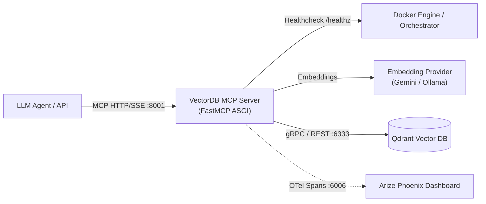

# VectorDB MCP Microservice Guide & Runbook

This guide covers running, configuring, and querying the containerized **VectorDB Model Context Protocol (MCP)** microservice (`src/tools/mcp/servers/vectordb.py`).

---

## 1. Overview & Architecture

The VectorDB MCP microservice exposes vector storage and semantic search capabilities to LLM agents over the standardized **Model Context Protocol (MCP)** via HTTP Server-Sent Events (SSE).

Key characteristics:
- **FastMCP Protocol**: Implements JSON-RPC 2.0 tool definitions (`vectordb_search` and `vectordb_store`) on top of FastMCP / Starlette ASGI (`app = mcp.sse_app()`).
- **Self-Contained Embeddings**: Embeds queries and documents within the microservice using `EmbeddingModelFactory` (Google Gemini, OpenAI, or local Ollama), decoupling agents from embedding client libraries.
- **Dual-Vector Storage**: Generates dense semantic vectors and sparse lexical vectors (BM25) on write, enabling hybrid reciprocal rank fusion search.
- **Multimodal Search**: Supports both local image file paths and Base64 data URLs (`data:image/<type>;base64,<payload>`) with automatic format detection.
- **Idempotent Ingestion**: Computes deterministic UUIDv5 content hashes when `id` is omitted to eliminate duplicate points.
- **Observability**: Built-in OpenTelemetry retriever spans exported to Arize Phoenix.



---

## 2. Environment Configuration

The microservice is configured via standard environment variables:

| Variable | Default | Description |
| :--- | :--- | :--- |
| `QDRANT_HOST` | `localhost` (or `qdrant` in Compose) | Hostname or IP of the Qdrant instance |
| `QDRANT_PORT` | `6333` | REST/gRPC port for Qdrant |
| `DEFAULT_COLLECTION_NAME` | `default_collection` | Target Qdrant collection name |
| `EMBEDDING_PROVIDER` | `google` | Embedding backend: `google`, `openai`, or `ollama` |
| `EMBEDDING_MODEL` | `gemini-embedding-001` | Model name for vector embeddings |
| `EMBEDDING_DIMENSIONS` | `3072` | Dense vector dimension for text |
| `EMBEDDING_IMAGE_DIMENSIONS` | `3072` | Vector dimension for multimodal images |
| `PHOENIX_COLLECTOR_ENDPOINT` | `http://phoenix:6006/v1/traces` | OTel trace export target |
| `GEMINI_API_KEY` | *(empty)* | API key when using Google Gemini provider |
| `OPENAI_API_KEY` | *(empty)* | API key when using OpenAI provider |
| `OLLAMA_BASE_URL` | `http://localhost:11434/v1` | Base URL when using local Ollama models |

---

## 3. How to Run

### 3.1 Via Docker Compose (Recommended)

The microservice is defined as `vectordb-mcp` in `docker-compose.yml` and listens on container port `8000` (mapped to host port `8001`):

```bash
# Start Qdrant, Arize Phoenix, and VectorDB MCP
docker compose up -d vectordb-mcp

# Follow live container logs
docker compose logs -f vectordb-mcp

# Stop service
docker compose stop vectordb-mcp
```

### 3.2 Local Standalone Execution (Development)

For rapid local testing outside Docker:

```bash
# Ensure local Qdrant is running (e.g. on port 6333)
docker compose up -d qdrant

# Run the FastMCP ASGI application with Uvicorn
uv run uvicorn src.tools.mcp.servers.vectordb:app --host 0.0.0.0 --port 8000 --reload
```

---

## 4. Healthcheck & Diagnostic Verification

The service provides a dedicated `/healthz` endpoint that tests network connectivity against Qdrant and verifies collection status:

```bash
# Probe health endpoint (returns HTTP 200 when Qdrant is reachable)
curl -i http://localhost:8001/healthz
```

**Healthy Response (`200 OK`):**
```json
{
  "status": "healthy",
  "qdrant": "connected",
  "collection": "default_collection",
  "points_count": 42
}
```

**Unhealthy Response (`503 Service Unavailable`):**
```json
{
  "status": "unhealthy",
  "error": "Connection refused to Qdrant at qdrant:6333"
}
```

---

## 5. Tool Interface Reference

The server advertises two core tools over MCP JSON-RPC:

### 5.1 `vectordb_search`

Executes semantic, hybrid, or multimodal image vector searches against Qdrant.

**Parameters:**
- `query` *(str, optional)*: Text query string for dense/hybrid search.
- `image` *(str, optional)*: Local filesystem path or Base64 data URL (`data:image/...`).
- `limit` *(int, default=5)*: Maximum number of points to retrieve.
- `score_threshold` *(float, default=0.0)*: Minimum cosine similarity score.
- `filters` *(dict, optional)*: Payload key-value filters (e.g. `{"category": "ai"}`).
- `sparse` *(bool, default=False)*: Enable BM25 hybrid search reranking.

**Return Structure:**
```json
[
  {
    "id": "e4d909c2-90ab-4220-a616-bb4d3e5883ef",
    "score": 0.892,
    "payload": {
      "text": "The Transformer architecture relies on self-attention mechanisms...",
      "source": "attention_paper.pdf",
      "category": "ai"
    }
  }
]
```

### 5.2 `vectordb_store`

Ingests documents or images into the collection with automatic dual-vector indexing.

**Parameters:**
- `text` *(str, optional)*: Document text content to embed and index.
- `image` *(str, optional)*: Local filesystem path or Base64 data URL.
- `payload` *(dict, optional)*: Metadata attributes attached to the vector point.
- `id` *(str, optional)*: Point ID. If omitted, computes deterministic UUIDv5 content hash.

**Return Structure:**
```json
{
  "id": "e4d909c2-90ab-4220-a616-bb4d3e5883ef",
  "status": "stored",
  "collection": "default_collection"
}
```

---

## 6. Usage Examples

### 6.1 Configuring within `configs/agent_config.yaml`

To mount the microservice into any agent generated by `PydanticAIAgentGenerator`:

```yaml
agent:
  name: "rag_agent"
  model: "gemini-3.5-flash-lite"
  provider: "google"
  tools: []
  mcp_servers:
    vectordb:
      type: "http"
      url: "http://vectordb-mcp:8000/sse"  # Use http://localhost:8001/sse if running host agent
      tool_prefix: "vdb"
      enabled_tools:
        - "vectordb_search"
        - "vectordb_store"
```

### 6.2 Programmatic Python Client Example

Using `McpConnectionManager` and the project's client tools:

```python
import asyncio
from src.tools.mcp.client import McpServerFactory
from src.agents.config import McpServerConfigSchema

async def main():
    config = McpServerConfigSchema(
        type="http",
        url="http://localhost:8001/sse",
        tool_prefix="vdb",
    )

    # 1. Discover registered tools dynamically
    tools = await McpServerFactory.fetch_tools(config)
    for tool in tools:
        print(f"Discovered: {tool.name} -> {tool.description}")

    # 2. Execute vectordb_store tool
    store_tool = next(t for t in tools if t.original_name == "vectordb_store")
    store_result = await store_tool.callable(
        text="FastMCP enables containerized MCP tools with native SSE transport.",
        payload={"topic": "mcp", "author": "team"}
    )
    print("Store Result:", store_result)

    # 3. Execute vectordb_search tool
    search_tool = next(t for t in tools if t.original_name == "vectordb_search")
    results = await search_tool.callable(query="How does FastMCP work?", limit=3)
    print("Search Results:", results)

if __name__ == "__main__":
    asyncio.run(main())
```

### 6.3 Low-Level MCP Client Example (`mcp.client.sse`)

Direct integration using official Python `mcp` SDK:

```python
import asyncio
from mcp.client.session import ClientSession
from mcp.client.sse import sse_client

async def query_mcp():
    async with sse_client("http://localhost:8001/sse") as (read_stream, write_stream):
        async with ClientSession(read_stream, write_stream) as session:
            await session.initialize()
            
            # Call vectordb_search
            result = await session.call_tool(
                "vectordb_search",
                arguments={"query": "agentic workflows", "limit": 2}
            )
            print("Tool Response:", result.content[0].text)

if __name__ == "__main__":
    asyncio.run(query_mcp())
```
