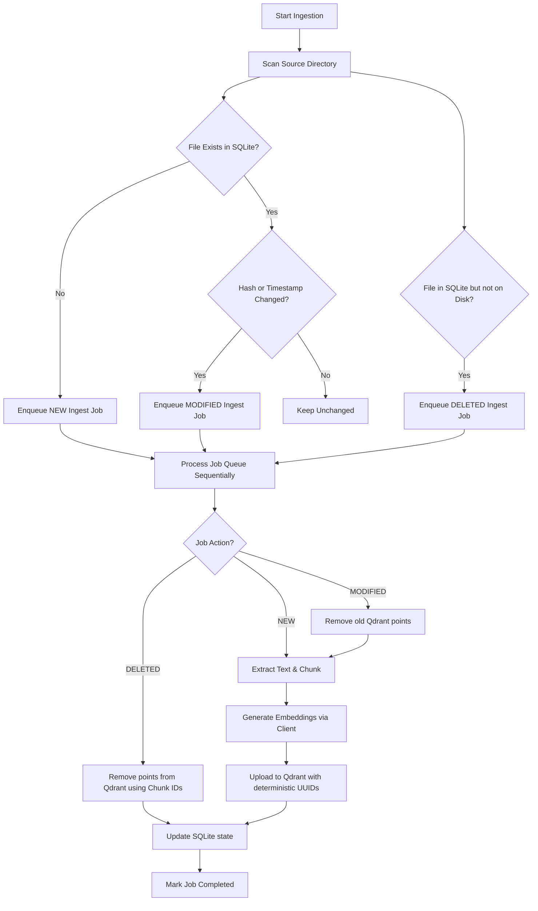

# Ingestion Pipeline & Delta Updates

This document describes the vector ingestion pipeline designed to ingest, chunk, embed, and synchronize local documents with a Vector Database (Qdrant).

---

## 1. Pipeline Overview

The Ingestion Pipeline parses files in a source directory, checks for changes, tracks state, and coordinates loading. It utilizes a two-step process:
1. **Delta Check**: Scans a directory for matching file types. Calculates SHA-256 hashes and modification timestamps. Compares them with records in a local SQLite database (`data/ingestion_state.db`).
2. **Job Queue Execution**: Any new, modified, or deleted file is registered in the SQLite `ingest_jobs` table. The runner processes these jobs sequentially, performing text extraction, text chunking, embedding generation, and VectorDB syncing.

---

## 2. Ingestion Configuration Schema

The configuration for the ingestion pipeline is written in YAML. The schema is validated using `IngestionConfigSchema` (built with Pydantic):

```yaml
source_directory: "data/source_docs"   # Directory containing files to ingest
collection_name: "wayfinder_docs"      # Target VectorDB collection name
chunk_size: 500                        # Maximum characters per chunk
chunk_overlap: 50                      # Characters of overlap between chunks
file_types:                            # Supported file extensions to parse
  - ".pdf"
  - ".txt"
  - ".md"
  - ".html"
embedding_model:                       # Model to use for text embeddings
  provider: "google"
  model: "text-embedding-004"
  dimensions: 768                      # Output dimensions of the model
vectordb:                              # Target Vector Database configuration
  type: "qdrant"
  host: "localhost"
  port: 6333
state_db_path: "data/ingestion_state.db"  # Path to SQLite state database
```

---

## 3. Ingestion Job Queue & Delta Updates

Delta tracking operates using the SQLite tables `files` and `ingest_jobs`:

* **`files` table**: Tracks the synchronization state of files.
  * Fields: `filepath`, `collection_name`, `last_modified`, `hash` (SHA-256), `chunk_ids` (JSON list).
* **`ingest_jobs` table**: Tracks pending actions to process.
  * Fields: `id`, `filepath`, `collection_name`, `action` (`NEW` / `MODIFIED` / `DELETED`), `status` (`PENDING` / `RUNNING` / `COMPLETED` / `FAILED`), `created_at`, `completed_at`, `error`.

### Syncing Logic
* **New File**: Extracted, chunked into pieces, embedded via `EmbeddingModelClient`, and uploaded. Its deterministic chunk IDs (generated using `uuid.uuid5` namespace based on filepath and chunk index) are recorded.
* **Modified File**: The pipeline first retrieves the old `chunk_ids` from SQLite and deletes them from Qdrant. Then, it chunks, embeds, and uploads the new content and updates the SQLite record.
* **Deleted File**: Retrieves old `chunk_ids`, deletes them from Qdrant, and deletes the record from SQLite.

---

## 4. Architecture Flow



---

## 5. Trace Instrumentation (Arize Phoenix)

The VectorDB searches and retrievals are instrumented using OpenTelemetry and OpenInference retriever semantic conventions. Every search emits a span of kind `RETRIEVER` containing:
* **`input.value`**: The search query string.
* **`db.system`**: `"qdrant"`
* **`db.name`**: Target collection name.
* **`retrieval.documents.{idx}.document.id`**: The UUID of the retrieved chunk.
* **`retrieval.documents.{idx}.document.content`**: The text content of the retrieved chunk.
* **`retrieval.documents.{idx}.document.score`**: The similarity score of the match.
* **`retrieval.documents.{idx}.document.metadata`**: JSON string of chunk metadata.
