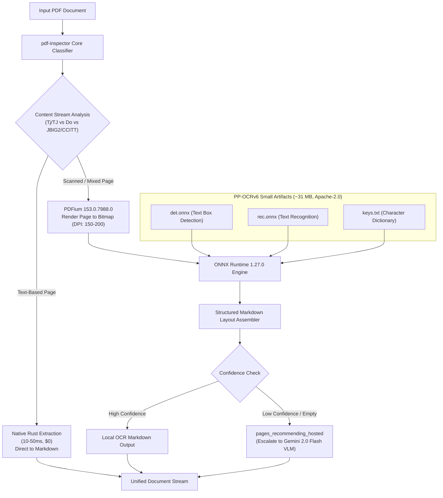
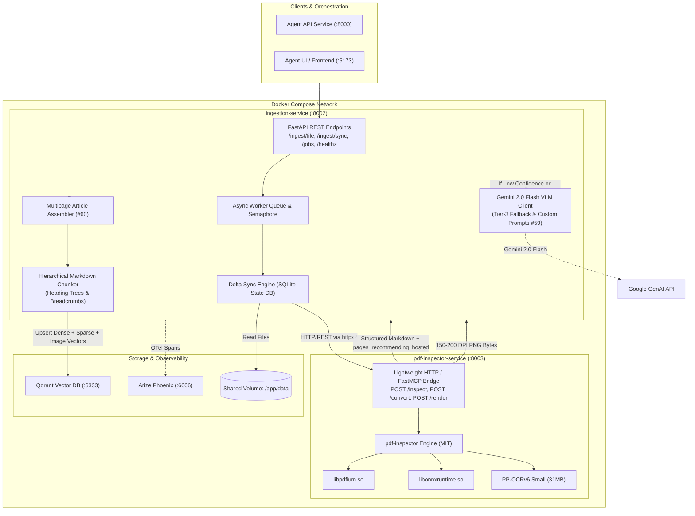
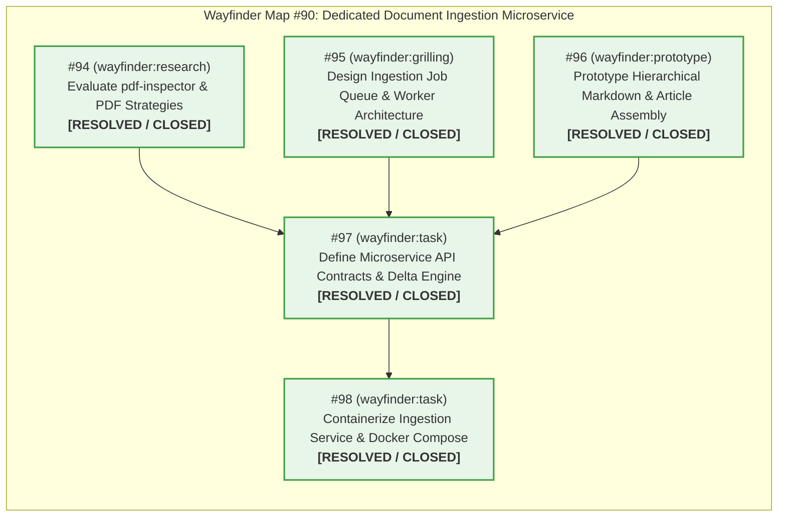

# Implementation Plan: Dedicated Document Ingestion Microservice (Issue #90)

## 1. Executive Summary & Problem Context

The repository currently provides a batch-oriented ingestion script (`src/ingestion/pipeline.py`) that syncs local files into Qdrant using basic character-window splitting (`fixed_chunker`) and flat regex Markdown splitting (`markdown_chunker`). While functional for simple text and markdown files, modern agentic RAG workflows require a **dedicated, production-grade microservice** that can:

1. **Operate as an autonomous containerized service** in Docker Compose with REST APIs for document uploads, directory synchronization, background job status polling, and vector collection management.
2. **Execute intelligent, multi-modal PDF ingestion** implementing the **"detect-then-route"** strategy inspired by [Firecrawl `pdf-inspector`](https://firecrawl.github.io/pdf-inspector/#architecture):
   - High-speed heuristic classification (`TextBased`, `Scanned`, `ImageBased`, `Mixed`) in <50ms.
   - Fast local extraction ($0 cost, 10–50ms/page) for native text pages.
   - Built-in local neural OCR via ONNX Runtime & PP-OCRv6 Small (~31 MB) for scanned pages without external cloud API dependencies.
   - Dual-mode visual & semantic processing (Issue #59): high-resolution raw page rasterization (150–200 DPI) for visual search and Vision LLM parsing (Gemini 2.0 Flash) with customizable system prompts for complex layouts or low-confidence pages.
3. **Guarantee commercial licensing compliance**: Explicitly eliminate **AGPL-3.0** dependencies (such as PyMuPDF) from production architectures, ensuring a 100% permissively licensed stack (MIT / Apache-2.0 / BSD).
4. **Deploy `pdf-inspector` as an independent container service**: Ensuring process isolation, preventing native parser segfaults/OOMs from impacting orchestrators, and providing transparent microservice boundaries.
5. **Assemble multi-page articles** (Issue #60) spanning across page boundaries in periodicals, magazines, and academic papers before chunking.
6. **Perform true hierarchical Markdown splitting** preserving heading trees (H1–H6), injecting breadcrumbs into chunk payloads, establishing parent-child chunk relationships, and preserving tables/codeblocks atomically.
7. **Guarantee delta synchronization** with content-hash idempotency, eliminating duplicate embeddings and purging orphaned vectors from Qdrant when source documents are modified or removed.
8. **Provide full observability** via OpenTelemetry and Arize Phoenix tracing across parsing, chunking, VLM calls, and vector upserts.

---

## 2. Ingestion Library Comparison & Strategic Suitability Analysis

A critical architectural prerequisite is evaluating existing PDF ingestion and OCR libraries across licensing, runtime efficiency, layout fidelity, and operational safety.

### 2.1 Comparative Analysis Matrix

| Library / Tool | Primary Language & Runtime | License (Commercial Viability) | Throughput / Latency (Page) | Local OCR Engine | Table & Layout Quality | Memory & Container Footprint | Strategic Suitability for Enterprise Template |
| :--- | :--- | :--- | :--- | :--- | :--- | :--- | :--- |
| **Firecrawl `pdf-inspector`** | Rust (core) + Python/Node bindings | **MIT** (100% Permissive) | **10–50 ms** (native text)<br>**300–800 ms** (ONNX OCR) | **PP-OCRv6 Small** via ONNX Runtime + PDFium (~31 MB) | High (structural Markdown, reading order) | **Ultra-lightweight** (~150 MB container image) | **STRONGLY RECOMMENDED (Primary Engine)**. MIT license, fast detect-then-route, built-in ONNX OCR, lightweight container isolation. |
| **PyMuPDF (`fitz`)** | C/C++ (MuPDF) + Python CFFI | **AGPL-3.0** (Commercial license requires paid Artifex contract) | **5–20 ms** (native text) | None natively (relies on Tesseract binding) | Low/Medium (raw text blocks, manual geometry) | Moderate (~300 MB) | **REJECTED FOR PRODUCTION CORE**. The AGPL-3.0 license is legally toxic for commercial SaaS or proprietary distribution without expensive commercial licensing. |
| **IBM Docling** | Python + C++ (`docling-parse`) | **MIT** | **800–2500 ms** | RapidOCR / EasyOCR / Tesseract | Exceptional (DocLayNet, TableFormer) | **Heavy** (4–8 GB container, PyTorch dependencies, 2GB RAM minimum) | **Viable Alternative for Dense Academic/Financial**, but container footprint and latency are prohibitive for lightweight default agent deployments. |
| **Marker / Surya** | Python + PyTorch | **GPL-3.0** / Custom Non-Commercial restrictions | **1.5–5 s** (GPU recommended) | Surya OCR (PyTorch) | Exceptional (LaTeX math, multi-column) | **Heavy** (6–10 GB image, requires CUDA for acceptable speed) | **REJECTED**. Restrictive/viral GPL licensing and strict GPU hardware requirements prevent zero-cost CPU containerization. |
| **`pypdf` / `pdfminer.six`** | Pure Python | **BSD-3-Clause** / **MIT** | **150–600 ms** | None | Low (frequent reading-order and column interleaving bugs) | Minimal (~50 MB) | **Insufficient**. Lacks layout reconstruction, table detection, and OCR. |
| **Cloud VLM (Gemini 2.0 Flash)** | Cloud API | Google Cloud Terms of Service | **800–1800 ms** | Multimodal Vision (Gemini 2.0) | State-of-the-Art (comprehends complex figures, handwriting) | **Zero local container footprint** | **STRONGLY RECOMMENDED AS TIER-3 FALLBACK**. Ideal for scanned/complex pages flagged by `pdf-inspector` or specialized user prompts. |

### 2.2 Strategic Decision
1. **Adopt Firecrawl `pdf-inspector` in a dedicated container (`pdf-inspector-service`)**:
   - Solves the AGPL dilemma: 100% MIT/Apache-2.0 permissive stack.
   - Built-in detect-then-route classifies pages in <50ms.
   - Built-in local ONNX PP-OCRv6 processes scanned pages on CPU with zero cloud API costs.
   - Isolates native PDF parsing/rendering into its own microservice container, protecting the Python agent service from memory leaks or segfaults.
2. **Layer Gemini 2.0 Flash Vision as the Adaptive Tier-3 Escalation**:
   - Any page flagged by `pdf-inspector` as `pages_recommending_hosted` (low confidence or complex diagrams) or explicitly configured with custom prompt tuning (#59) escalates to Gemini 2.0 Flash.

---

## 3. Deep Dive: `pdf-inspector` Built-in OCR Architecture

`firecrawl/pdf-inspector` provides optional, fully-featured local OCR without needing external cloud services:



### 3.1 Pinned Runtime Components
* **PDFium**: `native-v7988` (PDFium 153.0.7988.0) — High-performance, memory-safe PDF rendering engine (Apache-2.0 / BSD).
* **ONNX Runtime**: `v1.27.0` — High-efficiency neural inference engine (MIT).
* **Model Set**: `PP-OCRv6 Small` (revision `oar-ocr-v0.7.0` from `GreatV/oar-ocr`, Apache-2.0) consisting of 3 artifacts totaling ~31 MB:
  - `det.onnx`: DBNet-based text detection model.
  - `rec.onnx`: SVTR/CRNN-based text recognition model.
  - `keys.txt`: Character mapping dictionary.

### 3.2 Hermetic / Offline Execution
In Docker environments, models are baked into the container image at `/models/pp-ocrv6-small`, enabling air-gapped, zero-network local OCR:
```bash
export PDFIUM_LIB_PATH=/usr/lib/libpdfium.so
export ORT_DYLIB_PATH=/usr/lib/libonnxruntime.so
export PDF_INSPECTOR_MODEL_CACHE=/models/pp-ocrv6-small
pdf2md input.pdf --ocr auto --ocr-offline --ocr-model-dir /models/pp-ocrv6-small --json
```

### 3.3 Automated Escalation Seam (`pages_recommending_hosted`)
`pdf-inspector` outputs an explicit list of page indices (`pages_recommending_hosted`) where local OCR confidence fell below quality thresholds. The Python ingestion microservice intercepts these pages and forwards them to Gemini 2.0 Flash Vision, delivering optimal accuracy while keeping 90%+ of pages on zero-cost local compute.

---

## 4. Target Microservice Architecture



---

## 5. Architectural Modules & Specifications

### 5.1 Standalone `pdf-inspector-service` (`docker/Dockerfile.pdf_inspector`)
* **Base Image**: Debian-slim or Alpine with Rust toolchain.
* **Pre-bundled Dependencies**:
  - `libpdfium.so` (`native-v7988`)
  - `libonnxruntime.so` (`v1.27.0`)
  - `PP-OCRv6 Small` models baked into `/models/pp-ocrv6-small`
* **Exposed Endpoints**:
  - `POST /inspect`: Returns `{ "classification": "TextBased|Scanned|Mixed", "pages": [...] }` in <30ms.
  - `POST /convert`: Converts PDF bytes to Markdown with detect-then-route, returns `{ "markdown": "...", "pages_recommending_hosted": [...] }`.
  - `POST /render`: Renders specific pages to PNG bytes at 150–200 DPI for multimodal vector indexing.

---

### 5.2 Leaf Contracts (`src/ingestion/contracts/`)
Per repo guidelines, leaf contracts reside in `src/ingestion/contracts/` with **zero internal project imports**:
* `src/ingestion/contracts/types.py`: Enums (`PageClassification`, `PdfIngestionMode`, `JobStatus`, `ChunkingStrategy`).
* `src/ingestion/contracts/schemas.py`: DTOs (`IngestedChunk`, `InspectionResult`, `JobResponse`, `IngestRequest`).

---

### 5.3 Multipage Article Assembler (`src/ingestion/assembler.py` - Issue #60)
Reconstructs articles spanning multiple pages:
1. **Running Margin Stripping**: Detects recurring headers (top 8%) and footers (bottom 8%) appearing across $\ge 3$ pages.
2. **Column Flow Sorting**: Reconstructs multi-column reading order prior to cross-page merging.
3. **Trailing De-Hyphenation**: Merges split boundary words (`inter- / national` $\to$ `international`).
4. **Jump-Line Tracking**: Matches `"Continued on page X"` and `"Continued from page Y"` patterns.
5. **Semantic Verification**: Fast windowed embedding or LLM check at candidate article boundaries.

---

### 5.4 Hierarchical Markdown Splitter (`src/ingestion/chunkers/hierarchical.py`)
1. **Heading Tree (H1–H6)**: Recursive tree representation of sections and subsections.
2. **Breadcrumb Injection**: Prefixes each chunk with ancestor path:
   `[Context: Machine Learning > Quantization > 4-bit TurboQuant]`
3. **Parent-Child Linkage**: Leaf chunks store `parent_id`; parent section chunks store `child_ids` for hierarchical retrieval.
4. **Atomic Block Preservation**: Code blocks, tables, and lists are never split mid-entity.

---

### 5.5 Delta Synchronization Engine (`src/ingestion/delta.py`)
* **State DB**: SQLite (`data/ingestion_state.db`) tracking file hashes, mtimes, and vector point IDs.
* **Orphan Purging**: Deletes stale chunk IDs from Qdrant when source documents are edited or deleted.
* **Deterministic IDs**: `uuid5(NAMESPACE_DNS, f"{filepath}:{chunk_index}:{chunk_hash}")`.

---

## 6. Wayfinder Map & Ticket Status



### Ticket Status Matrix

| Issue # | Type | Title | Status |
| :--- | :--- | :--- | :--- |
| **[#90](https://github.com/fortis3000/agentic_template/issues/90)** | `wayfinder:map` | **Wayfinder Map: Dedicated Document Ingestion Microservice** | **Completed Map (5/5 Tickets Closed)** |
| **[#94](https://github.com/fortis3000/agentic_template/issues/94)** | `wayfinder:research` | **Evaluate Firecrawl `pdf-inspector` & PDF Extraction Strategies** | **Closed / Resolved** (Strategic decision: Dedicated `pdf-inspector-service` container with ONNX PP-OCRv6, PDFium, and Gemini 2.0 Flash tier-3 escalation). |
| **[#95](https://github.com/fortis3000/agentic_template/issues/95)** | `wayfinder:grilling` | **Design Ingestion Job Queue & Asynchronous Worker Architecture** | **Closed / Resolved** (In-process persistent SQLite queue in WAL mode, asyncio worker pool, lease timeouts, REST polling; ADR-0001, ADR-0002). |
| **[#96](https://github.com/fortis3000/agentic_template/issues/96)** | `wayfinder:prototype` | **Prototype Hierarchical Markdown Splitting & Multipage Article Assembly** | **Closed / Resolved** (Option A INLINE_PREFIX breadcrumbs, adaptive context-safe chunking for oversized tables/code, parent-child Qdrant payload linkages; Multipage assembly #60 deferred out of scope). |
| **[#97](https://github.com/fortis3000/agentic_template/issues/97)** | `wayfinder:task` | **Define Ingestion Microservice API Contracts & Delta Sync Engine** | **Closed / Resolved** (Defined canonical REST schemas & leaf contracts in `src/ingestion/contracts/`; implemented `SQLiteJobQueue` and `SQLiteDeltaEngine`; direct `AsyncQdrantClient` batch upserting; ADR-0004). |
| **[#98](https://github.com/fortis3000/agentic_template/issues/98)** | `wayfinder:task` | **Containerize Ingestion Microservice & Docker Compose Integration** | **Closed / Resolved** (Authored `src/ingestion/service.py` FastAPI app and `docker/Dockerfile.ingestion`; integrated `ingestion-service` with healthcheck into `docker-compose.yml`; 11/11 integration tests verified). |

---

## 7. Verification & Testing Strategy

1. **`pdf-inspector-service` Container Tests**:
   - Verify healthcheck, `/inspect`, `/convert`, and `/render` endpoints with sample digital text, scanned, and mixed PDFs.
   - Verify ONNX PP-OCRv6 model execution on CPU without network access (`offline=True`).
2. **Hierarchical Splitter Unit Tests (`tests/test_hierarchical_chunker.py`)**:
   - Heading tree validation, breadcrumb string verification, table/code block atomicity.
3. **Multipage Article Assembly Unit Tests (`tests/test_article_assembler.py`)**:
   - Margin stripping across repeating headers/footers, cross-page de-hyphenation.
4. **Delta Sync Integration Tests (`tests/test_ingestion_delta.py`)**:
   - Verifying Qdrant vector deletion and SQLite state consistency across NEW, MODIFIED, and DELETED file lifecycles.
5. **End-to-End Microservice Verification**:
   - Validating OTel spans emitted to Arize Phoenix and document search via `vectordb_search` MCP tool.
