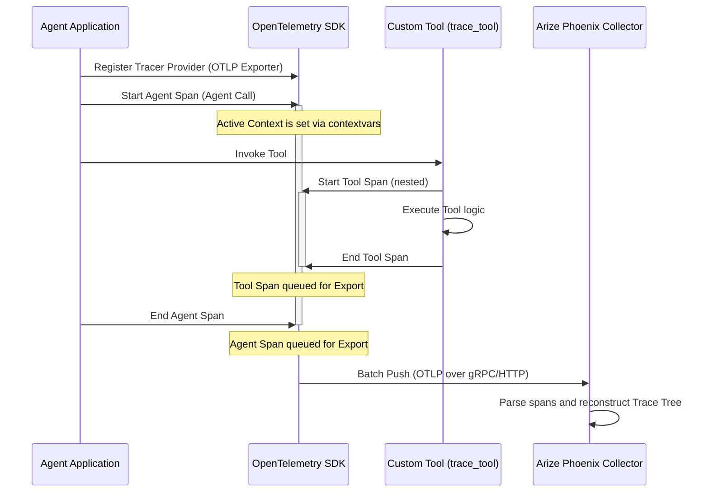

# Arize Phoenix and OpenTelemetry Tracing Architecture

This document describes in detail how OpenTelemetry (OTel), OpenInference, and Arize Phoenix work together in this repository to provide observability and tracing for LLM agent execution.

---

## 1. Core Architectural Components

To trace agent executions and tool calls, the framework relies on three distinct layers working in harmony:

```mermaid
┌─────────────────────────────────────────────────────────────────────────┐
│                           Agent Application                             │
│  (google-antigravity SDK, custom tools, agent loops)                    │
└────────────────────────────────────┬────────────────────────────────────┘
                                     │
                                     ▼ (OpenTelemetry API)
┌─────────────────────────────────────────────────────────────────────────┐
│                         OpenTelemetry Python SDK                        │
│  (Manages spans, Trace context propagation via contextvars)             │
└────────────────────────────────────┬────────────────────────────────────┘
                                     │
                                     ▼ (OpenInference Semantic Conventions)
┌─────────────────────────────────────────────────────────────────────────┐
│                           OTLP Span Exporter                            │
│  (Serializes traces into protobuf/JSON payloads)                        │
└────────────────────────────────────┬────────────────────────────────────┘
                                     │
                                     ▼ (OTLP over gRPC / HTTP)
┌─────────────────────────────────────────────────────────────────────────┐
│                             Arize Phoenix                               │
│  (OTLP Collector + Visualization Dashboard UI)                          │
└─────────────────────────────────────────────────────────────────────────┘
```

### A. OpenTelemetry (OTel)

OpenTelemetry is a vendor-neutral, industry-standard observability framework. It provides:

* **APIs**: Standard interfaces for writing code to generate telemetry data (traces, metrics, logs).
* **SDKs**: Implementation libraries that manage the state, context, batching, and exporting of the telemetry data.
* **Context Propagation**: A mechanism to pass trace identifiers across asynchronous tasks, threads, and network boundaries so that nested events are correctly correlated.

### B. OpenInference

OpenTelemetry is designed for general software (like HTTP requests or database queries). **OpenInference** (maintained by Arize) is a set of semantic conventions (metadata guidelines) built *on top* of OpenTelemetry specifically for Generative AI and LLM agents.
Instead of generic database tags, it defines standard OTel attributes for:

* `openinference.span.kind`: Demarcates whether a span is an `AGENT`, `CHAIN`, `LLM`, or `TOOL`.
* `input.value` and `output.value`: Captures LLM inputs/outputs and tool arguments.
* `llm.model_name`: Records the model version used (e.g., `gemini-3.5-flash`).

### C. Arize Phoenix

Arize Phoenix acts as two components:

1. **OTLP Collector**: An HTTP/gRPC server that listens for OpenTelemetry Protocol (OTLP) data payloads.
2. **Visualization Dashboard**: A web application that parses the received OTLP traces and presents them in a nested DAG (Directed Acyclic Graph) showing the exact step-by-step execution path of the agent.

---

## 2. Step-by-Step Telemetry Execution Flow

When you run an agent, the following sequence occurs:



### Step 3: Initialization and Registration

Before any execution begins, the system registers the global tracer provider. In `src/evals/phoenix_service.py`, this is done using:

```python
from phoenix.otel import register
register(project_name="agentic-template", auto_instrument=True)
```

**Under the Hood**:

1. The SDK instantiates a `TracerProvider`.
2. It configures an `OTLPSpanExporter` pointing to the collector endpoint (either local `http://localhost:6006/v1/traces` or Docker-orchestrated gRPC endpoint `http://phoenix:4317`).
3. It sets up a `SpanProcessor` (usually `BatchSpanProcessor` in production or `SimpleSpanProcessor` in tests) which acts as the buffer holding spans before they are sent to the exporter.

### Step 4: Context Initialization (Entering the Agent Span)

When you call `await agent.call(inputs=...)` or `agent.call_stream(inputs=...)`:

```python
with tracer.start_as_current_span(name="gemini-3.5-flash call", attributes={...}) as span:
```

1. A new `Span` is instantiated with a randomly generated **Span ID** and a **Trace ID** (which groups all nested spans together).
2. The SDK sets this span as the *current active span* in the thread/task-local storage using Python's `contextvars`. Any child operations initiated inside this `with` block will automatically read this context and register themselves as children of this span.

### Step 5: Executing a Wrapped Tool

When the agent decides to invoke a tool (like `get_weather`), the execution goes through the `trace_tool` decorator wrapper:

```python
with tracer.start_as_current_span(name=tool_name, attributes={...}) as span:
    res = tool_func(*args, **kwargs)
    span.set_attribute(SpanAttributes.OUTPUT_VALUE, str(res))
    return res
```

1. The OTel SDK checks `contextvars` and sees that the active span is the **Agent Span**.
2. The new **Tool Span** is created with the same **Trace ID**, but its `parent_span_id` is set to the Agent Span's ID.
3. OpenInference conventions are populated:
    * `SpanAttributes.OPENINFERENCE_SPAN_KIND`: `"TOOL"`
    * `SpanAttributes.INPUT_VALUE`: JSON string of `args` and `kwargs` passed to the tool.
    * `SpanAttributes.TOOL_DESCRIPTION`: Extracted from the tool function's docstring.

### Step 6: Exception Capture and Status Upgrades

If the tool or LLM call raises an exception (e.g. invalid arguments or API failure):

```python
except Exception as e:
    span.set_status(trace.StatusCode.ERROR, str(e))
    raise
```

1. We manually set the span status to `StatusCode.ERROR`.
2. When the exception propagates out of the `with tracer.start_as_current_span(...)` context manager, the OTel SDK's `__exit__` method automatically captures the exception, formats the stack trace, and logs it as an internal **Span Event** named `"exception"`.

### Step 7: Ending and Exporting Spans

When execution exits the `with` blocks (both successful completion and failure propagation):

1. The SDK calls `span.end()`, recording the ending timestamp to calculate exact latency.
2. The completed spans are placed in the `SpanProcessor` queue.
3. The processor serializes the spans into OTLP protocol buffers (protobuf) or JSON payloads and posts them asynchronously to the Arize Phoenix collector via HTTP or gRPC.

---

## 3. Processing and Visualization in Arize Phoenix

Once the Arize Phoenix server receives the OTLP payload:

1. **DAG Reconstruction**: Phoenix reads the list of spans and uses the `trace_id`, `span_id`, and `parent_span_id` of each span to reconstruct a parent-child execution tree.
2. **Semantic Recognition**: Phoenix parses the OpenInference attributes:
   * Because it sees `openinference.span.kind = TOOL`, it renders the span in the UI with a special tool icon, separating its input arguments and return results.
   * Because it sees `openinference.span.kind = AGENT`, it knows this represents the top-level orchestrator block and displays the prompt template and overall system role.
3. **Error Highlights**: If a span's status code is `ERROR` and contains an `exception` event, Phoenix highlights the entire parent-child trace tree path in red, letting you expand the exact tool or step that failed and read the stack trace immediately.
